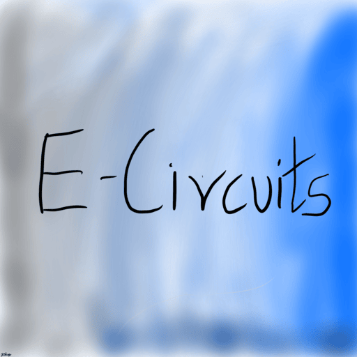

# E-Circuits

<!--  -->
An android and a web application that allows you to learn and simulate very basic digital circuits and concepts of digital electronics.
The app provides you with various Integrated Circuits of logic gates which one can use to practice and understand the core logic behind our modern digital world.

The Help section within the app guides the user through the workings of the app.

E-Circuits contains 2 inputs and 3 inputs :
- AND gate 
- OR gate
- NOT gate
- NAND gate
- NOR gate
- XOR gate

Double tap on any gate to add it to your circuit.

The users can add as many gates as they want and simulate live circuits with the given inputs,outputs,Vcc(power source) and Gnd(ground).

## Installation:
### Website :
[https://e-circuitz.vercel.app/](https://e-circuitz.vercel.app/)
### Web Application (run locally) :
- Requirements:
    - Node.js
    - VS code (or any code editor with command line)
    - Internet (Only during intial installation)
- Download the source code into your computer/laptop.
- Open it in your code editor and in the terminal type:

    `
    npm install
    `

- After the installation is complete

    `
    npm run dev
    `

- Open the link in the terminal andddddddd you are good to go.

### Android Application :
- Download the apk by clicking the link given below :
- [E-Circuits v1.0](https://github.com/J0sh-ini/E-Circuits/releases/download/v1.0/E-Circuits.apk)
- Allow whatever permission is required . Im not gonna steal yo data :)
- Though the android version is accessible everywhere , the smaller screen size is a negative.

